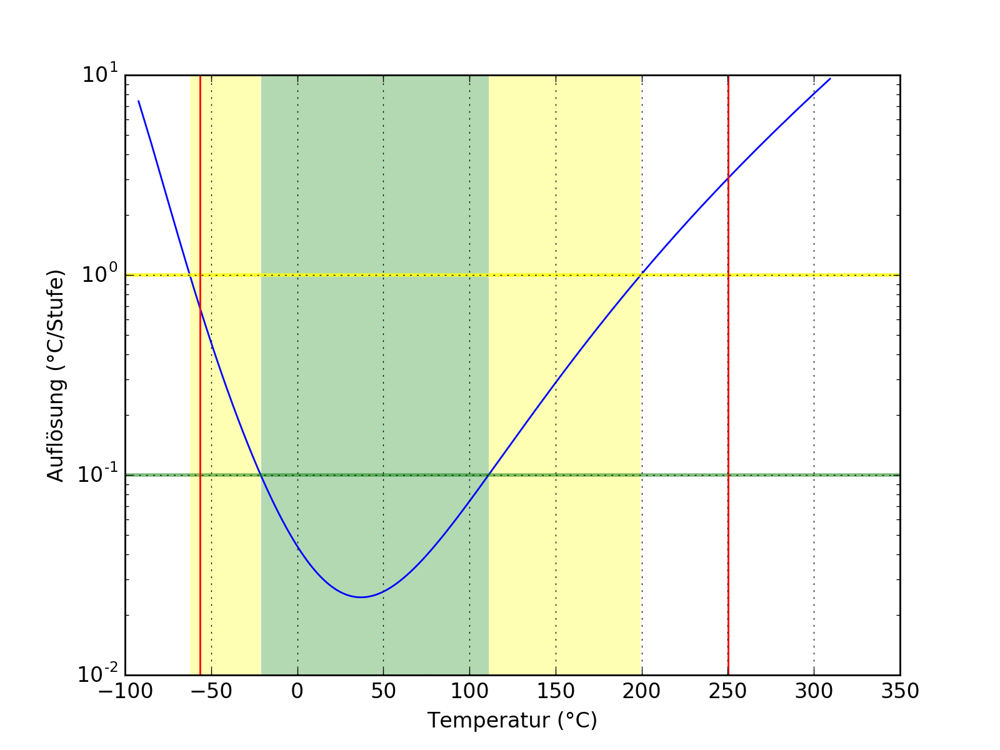
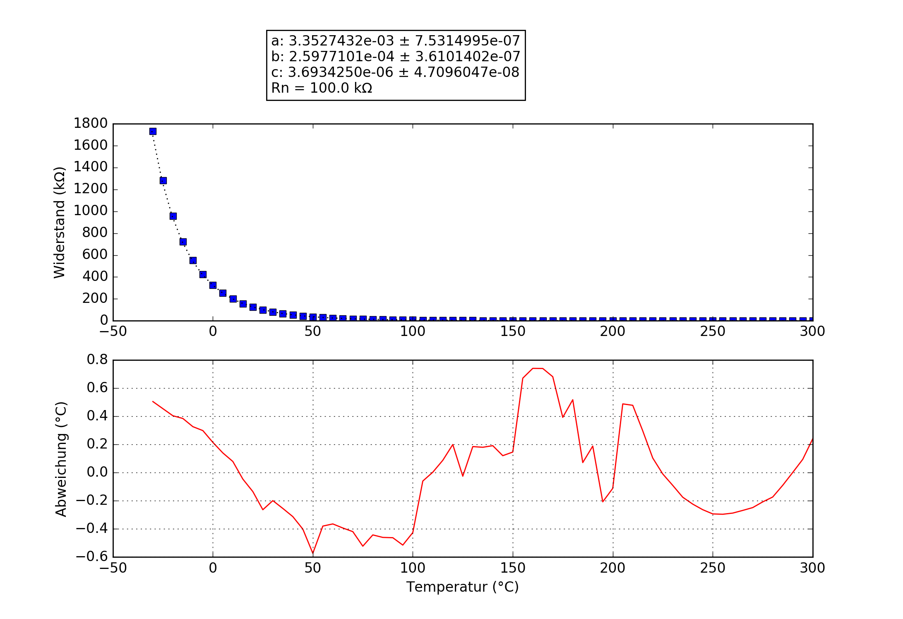

## 100K3950
### Probe performance data

Property | Symbol | Value
-------- | -------- | --------
Resistance at 25°C | R25 | 101.15 kΩ
Beta 25°C to 85°C | B25/85| 3978 K
Minimum measurable temperature | | 250.1 °C
Minimum high-res temperature | | 111.1 °C
Maximum high-res temperature | | -21.1 °C
Maximum measurable temperature | | -56.3 °C

### Probe curve data

