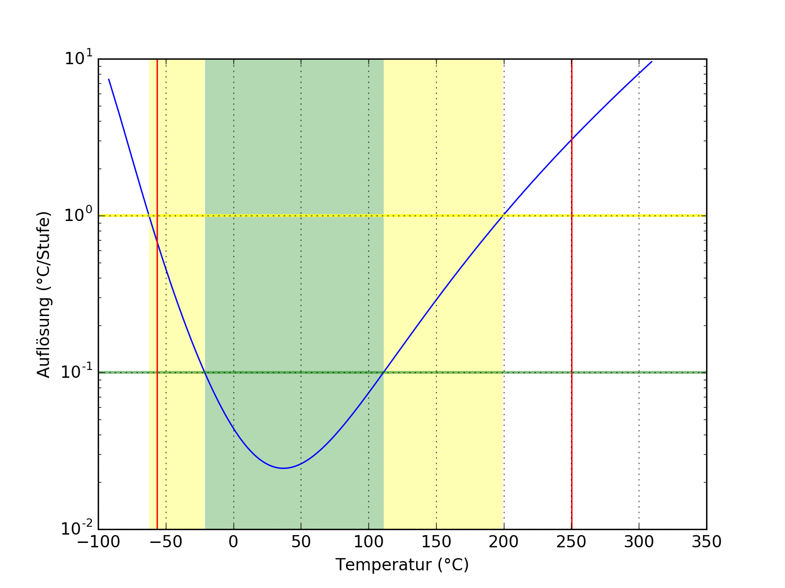
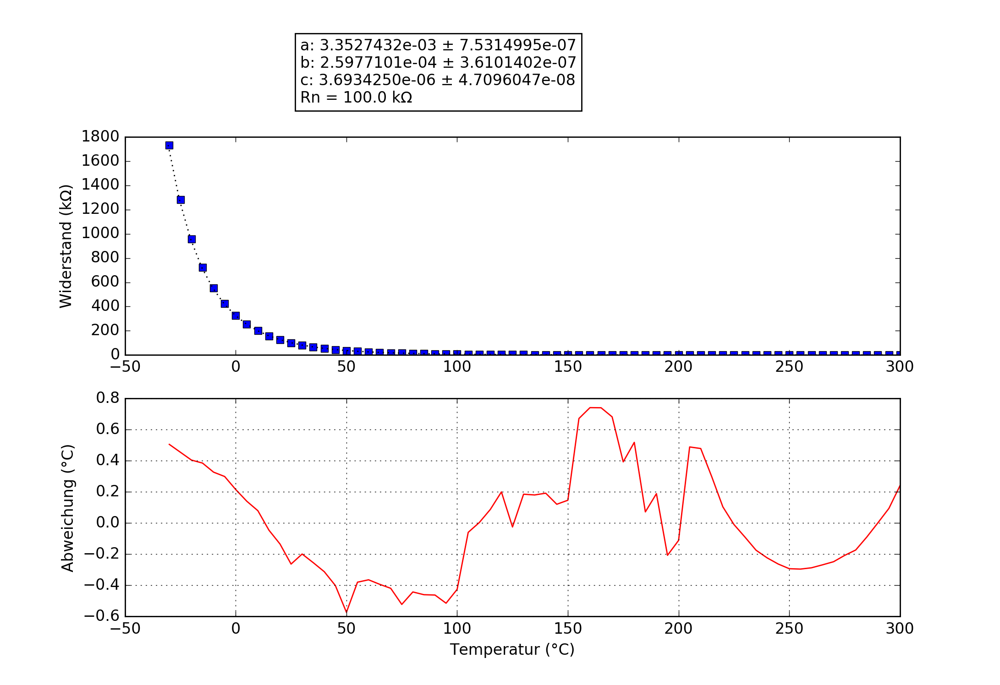

## 100K3950
### Probe performance data

Values based on 47 kΩ measurement resistor.

Property | Symbol | Value
-------- | -------- | --------
Resistance at 25°C | R25 | 101.15 kΩ
Beta 25°C to 85°C | B25/85| 3978 K
Minimum measurable temperature | | 250.1 °C
Minimum high-res temperature | | -21.1 °C
Highest resolution || 2.45e-02 °C/step at 37.0 °C
Maximum high-res temperature | | 111.1 °C
Maximum measurable temperature | | -56.3 °C

### Probe curve data

Property | Symbol | Value
-------- | -------- | --------
Resistance near 25°C | R25 | 101.15 kΩ
Steinhart Hart Factor | a | 3.3527432e-03 ± 7.5314995e-07 
Steinhart Hart Factor | b | 2.5977101e-04 ± 3.6101402e-07
Steinhart Hart Factor | c | 3.6934250e-06 ± 4.7096047e-08

